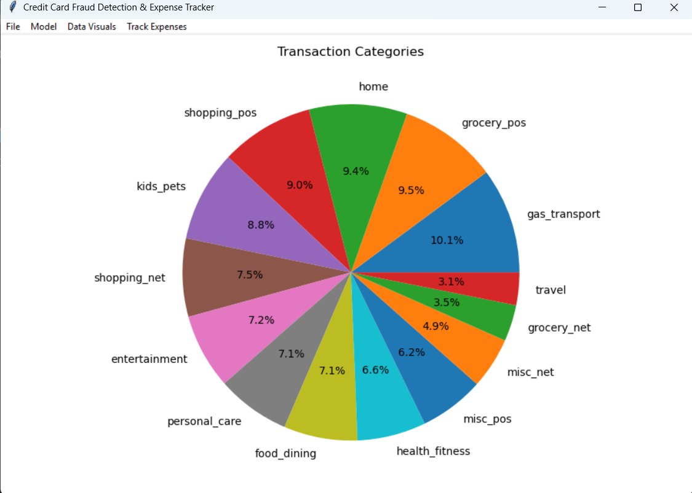
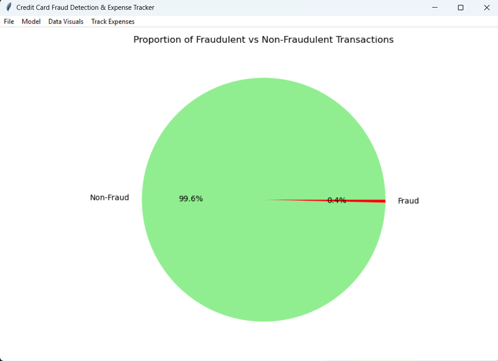
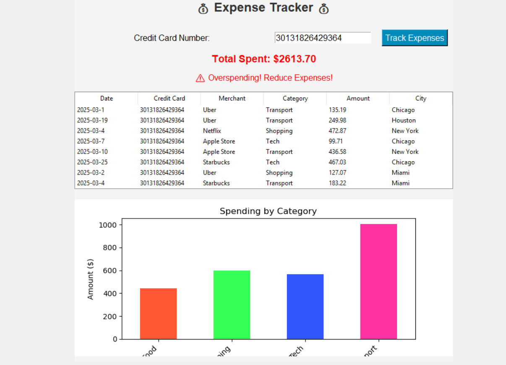
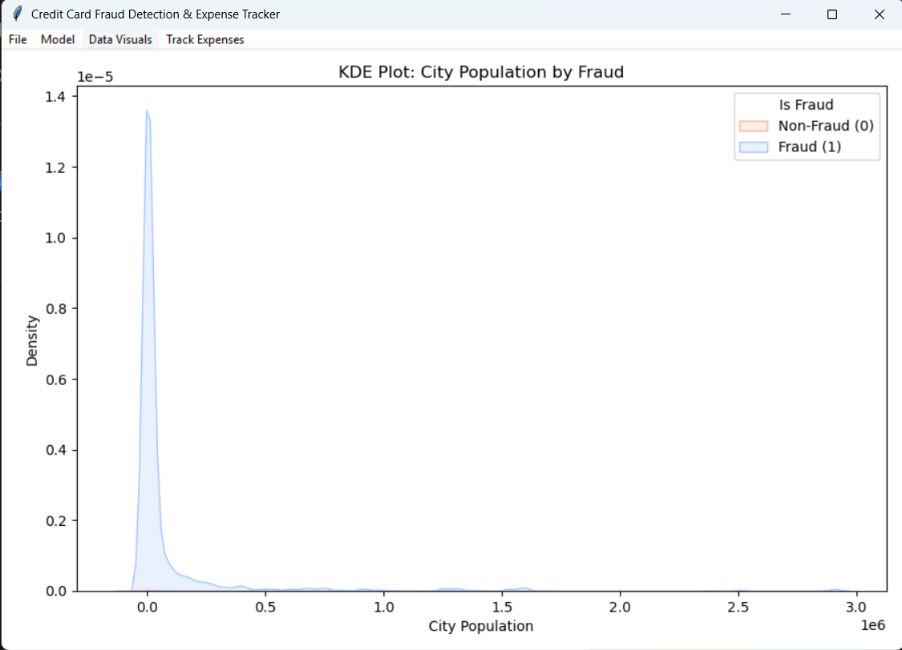
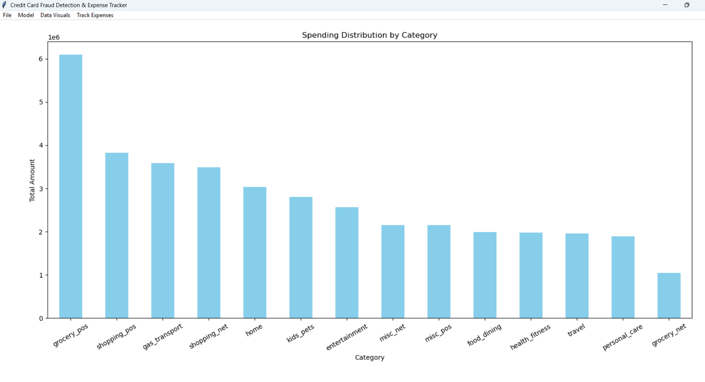
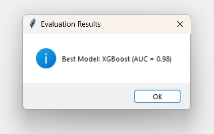
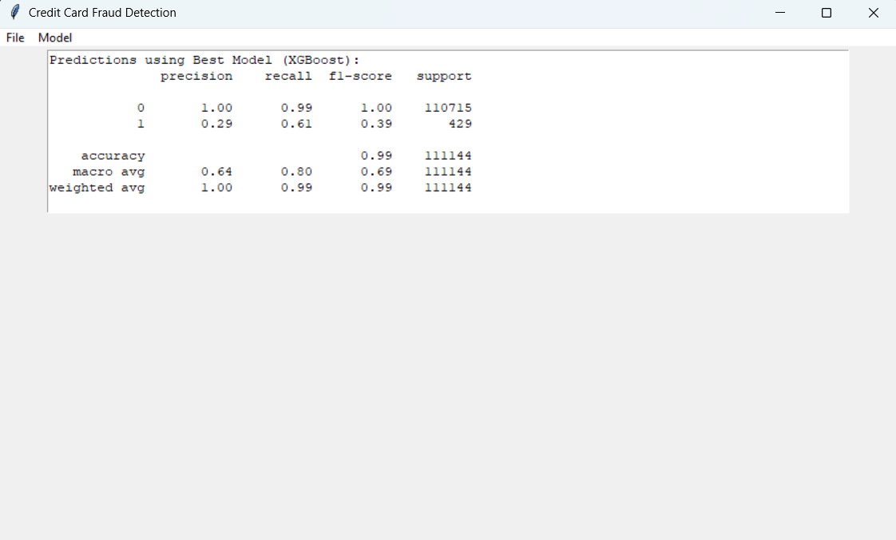

# CREDIble - A fraud detection app using tkinter
## Use Case
This system integrates machine learning algorithms with real-time data analytics to revolutionize fraud detection practices. At its core, the system utilizes advanced models such as XGBoost, Random Forest, and Isolation Forest to analyze transaction patterns and identify anomalies indicative of fraudulent activity. By leveraging predictive analytics, the system evaluates parameters such as transaction amount, location, frequency, and user behavior to make informed decisions about potential threats.
## Prerequisite
  Python /
  Tkinter
## Front End
Percentage of transaction categories.\

Percentage of fraud vs non-fraud transactions.\

Expense tracker UI to track expenses on categories spent.\

City population by fraud.\

Bar chart on spending.\

Analysis of best model.\

Results of best model prediction.\

